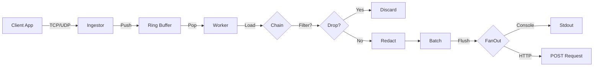

# StreamGate Architecture

This document provides a comprehensive overview of StreamGate's internal design, component interactions, and key architectural decisions.

---

## Table of Contents
1. [High-Level Design (HLD)](#high-level-design-hld)
2. [Data Flow](#data-flow)
3. [Core Components](#core-components)
4. [Concurrency Model](#concurrency-model)
5. [Control Plane Sync](#control-plane-sync)
6. [Design Decisions & Trade-offs](#design-decisions--trade-offs)

---

## High-Level Design (HLD)

StreamGate uses a **Split-Plane Architecture** to separate concerns:

```
┌─────────────────────────────────────────────────────────────┐
│                        User/Developer                        │
└───────────────────────┬─────────────────────────────────────┘
                        │ HTTP API (REST)
                        ▼
┌─────────────────────────────────────────────────────────────┐
│                   Control Plane (Python)                     │
│  ┌──────────────┐  ┌──────────────┐  ┌──────────────┐      │
│  │  REST API    │  │  Rule Store  │  │   Manifest   │      │
│  │  (FastAPI)   │─▶│  (In-Memory) │─▶│   Builder    │      │
│  └──────────────┘  └──────────────┘  └──────┬───────┘      │
└─────────────────────────────────────────────┼───────────────┘
                                              │ Publish
                                              ▼
                        ┌──────────────────────────────┐
                        │       Redis (Pub/Sub)        │
                        │  Key: streamgate_config      │
                        │  Channel: streamgate_updates │
                        └──────────┬───────────────────┘
                                   │ Subscribe
                                   ▼
┌─────────────────────────────────────────────────────────────┐
│                    Data Plane (Go)                           │
│  ┌──────────────┐  ┌──────────────┐  ┌──────────────┐      │
│  │  Ingestor    │─▶│ Ring Buffer  │─▶│   Pipeline   │      │
│  │  (TCP/UDP)   │  │  (Lock-Free) │  │   (Worker)  │      │
│  └──────────────┘  └──────────────┘  └──────┬───────┘      │
│                                              │               │
│  ┌──────────────┐                            ▼               │
│  │   Watcher    │          ┌─────────────────────────────┐  │
│  │ (Hot Reload) │          │  Processor Chain (Atomic)   │  │
│  └──────────────┘          │  ┌─────────┐  ┌─────────┐   │  │
│                            │  │ Filter  │─▶│ Redact  │   │  │
│                            │  └─────────┘  └─────────┘   │  │
│                            └─────────────────┬───────────┘  │
│                                              ▼               │
│                            ┌─────────────────────────────┐  │
│                            │   Output (Fan-Out)          │  │
│                            │  ┌─────────┐  ┌─────────┐   │  │
│                            │  │Console  │  │  HTTP   │   │  │
│                            │  └─────────┘  └─────────┘   │  │
│                            └─────────────────────────────┘  │
└─────────────────────────────────────────────────────────────┘
                                   │
                                   ▼
                        ┌──────────────────────┐
                        │  Upstream Vendors    │
                        │ (Datadog, Splunk...) │
                        └──────────────────────┘
```

### Why Split-Plane?

1. **Decoupling**: Configuration changes don't affect data throughput.
2. **Language Optimization**: Python for API ergonomics, Go for performance.
3. **Scalability**: Data Plane can scale horizontally (stateless workers).

---

## Data Flow

### Log Lifecycle



### Step-by-Step Flow

1. **Ingestion**: TCP/UDP listeners accept raw bytes.
2. **Buffer**: Logs pushed into a Fixed-Size Ring Buffer (FIFO).
3. **Worker**: Single goroutine pops from buffer.
4. **Processing**:
   - Loads current `ProcessorChain` atomically.
   - Applies Filters (drop if matched).
   - Applies Redaction (regex replacement).
5. **Batching**: Accumulates logs until batch size or timeout (100ms).
6. **Output**: Sends batch to all configured outputs concurrently.

---

## Core Components

### 1. Ingestor (`pkg/ingest/`)

**Purpose**: Accept logs from external sources.

**Components**:
- **TCP Ingestor** (`tcp.go`): Persistent connections, line-delimited.
- **UDP Ingestor** (`udp.go`): Fire-and-forget, packet-based.

**Design Choice**: Separate listeners avoid blocking. UDP won't be delayed by slow TCP connections.

**Key Code**:
```go
func (u *UDPIngestor) Start(ctx context.Context) {
    go func() {
        buf := make([]byte, 65535) // Max UDP packet
        for {
            n, err := u.conn.Read(buf)
            data := make([]byte, n)
            copy(data, buf[:n])
            u.buffer.Push(data) // Non-blocking
        }
    }()
}
```

---

### 2. Ring Buffer (`pkg/engine/buffer.go`)

**Purpose**: Decouple ingestion rate from processing rate.

// RingBuffer is a fixed-size circular buffer for byte slices.
// It is safe for a single writer (Ingestor) and single reader (Processor).
// For multiple writers, see GitHub Issue #6 (Multi-Producer Support).
type RingBuffer struct {
- Channels allocate per-message.
- Ring Buffer reuses memory slots.
- Better cache locality for high-throughput scenarios.

**Trade-offs**:
- Fixed size: If full, old data is overwritten (oldest logs dropped).
- No backpressure to source (by design for "Fail-Open").

**Key Methods**:
```go
func (rb *RingBuffer) Push(data []byte) {
    idx := atomic.AddUint64(&rb.tail, 1) % capacity
    rb.items[idx].Store(&data)
}

func (rb *RingBuffer) Pop() []byte {
    idx := atomic.AddUint64(&rb.head, 1) % capacity
    return rb.items[idx].Load()
}
```

---

### 3. Pipeline (`pkg/engine/pipeline.go`)

**Purpose**: Orchestrate processing workers.

**Architecture**:
- **Single Worker** (currently): Ensures strict ordering.
- **Batch Accumulation**: Reduces syscall overhead for outputs.
- **Fail-Open Circuit Breaker**: If buffer >80% full, skip processing.

**Hot-Swap Mechanism**:
```go
type Pipeline struct {
    chain  atomic.Pointer[ProcessorChain]
    output atomic.Value // stores *FanOutOutput
    batchSize atomic.Int64
}

func (p *Pipeline) UpdateChain(newChain *ProcessorChain) {
    p.chain.Store(newChain) // Atomic swap, no locks
}
```

**Why Atomic Pointers?**
- Worker reads chain on every log: `currentChain := p.chain.Load()`.
- No mutex contention on hot path.
- Safe concurrent reads/writes.

**Fail-Open Logic**:
```go
if float64(bufferUsage) > float64(capacity)*0.80 {
    batch = append(batch, item) // Skip chain, just drain
} else {
    processed, drop, _ := currentChain.Process(ctx, item)
    if !drop { batch = append(batch, processed) }
}
```

---

### 4. Processor Chain (`pkg/engine/chain.go`)

**Purpose**: Apply transformations sequentially.

**Pattern**: Chain of Responsibility.

**Processors**:
1. **FilterProcessor** (`filter.go`): Drops logs containing keywords.
2. **RedactionProcessor** (`redact.go`): Regex-based PII removal.

**Example**:
```go
chain := NewProcessorChain(
    NewFilterProcessor("filter_debug", []string{"DEBUG"}),
    NewRedactionProcessor("redact_ssn", `\d{3}-\d{2}-\d{4}`, "XXX-XX-XXXX"),
)
```

**Extensibility**: New processors implement:
```go
type Processor interface {
    Process(ctx *ProcessingContext, data []byte) ([]byte, bool, error)
    Name() string
}
```

---

### 5. Output Layer (`pkg/output/`)

**Components**:
- **ConsoleOutput** (`console.go`): Writes to stdout.
- **HTTPOutput** (`http.go`): POST batches to external API.
- **FanOutOutput** (`fanout.go`): Multiplexes to multiple outputs.

**Fan-Out Pattern**:
```go
type FanOutOutput struct {
    outputs []Output
}

func (f *FanOutOutput) WriteBatch(entries [][]byte) error {
    var wg sync.WaitGroup
    for _, out := range f.outputs {
        wg.Add(1)
        go func(o Output) {
            defer wg.Done()
            o.WriteBatch(entries) // Parallel writes
        }(out)
    }
    wg.Wait()
    return firstError
}
```

**Why Goroutines per Output?**
- HTTP might be slow (network latency).
- Console is instant.
- Don't want HTTP to block Console.

---

### 6. Config Watcher (`pkg/control/watcher.go`)

**Purpose**: Listen for configuration updates from Redis.

**Flow**:
1. Subscribe to `streamgate_updates` channel.
2. On message, fetch `streamgate_config` key from Redis.
3. Unmarshal JSON into `Manifest`.
4. Rebuild `ProcessorChain` and `FanOutOutput`.
5. Call `pipeline.UpdateChain()` and `pipeline.UpdateOutput()`.

**Key Design**:
```go
func (w *Watcher) reload() {
    manifest := fetchFromRedis()
    
    // Build new chain
    processors := buildProcessors(manifest.Pipelines[0].Processors)
    newChain := engine.NewProcessorChain(processors...)
    w.pipeline.UpdateChain(newChain) // Atomic swap
    
    // Build new outputs
    outputs := buildOutputs(manifest.Pipelines[0].Outputs)
    w.pipeline.UpdateOutput(output.NewFanOutOutput(outputs...))
    
    // Update batch size
    w.pipeline.UpdateBatchSize(int64(manifest.Pipelines[0].BatchSize))
}
```

---

## Concurrency Model

### Goroutine Usage

| Component       | Goroutines | Purpose                          |
|-----------------|------------|----------------------------------|
| TCP Listener    | 1          | Accept connections               |
| TCP Handlers    | N          | One per client connection        |
| UDP Listener    | 1          | Read packets                     |
| Pipeline Worker | 1          | Process & batch logs             |
| Watcher         | 1          | Redis Pub/Sub listener           |
| FanOut Writers  | M          | One per output (transient)       |

**Total Active**: ~3-10 goroutines (low overhead).

### Synchronization Primitives

| Primitive         | Used Where              | Why?                          |
|-------------------|-------------------------|-------------------------------|
| `atomic.Pointer`  | ProcessorChain          | Lock-free hot-swap            |
| `atomic.Value`    | Output                  | Type-safe atomic swap         |
| `atomic.Int64`    | BatchSize, Buffer ptrs  | Wait-free read/write          |
| `sync.WaitGroup`  | FanOut                  | Wait for parallel writes      |
| Channels          | Context cancellation    | Graceful shutdown             |

**No Mutexes on Hot Path**: All critical sections use atomics to avoid contention.

---

## Control Plane Sync

### Redis Contract

**Key**: `streamgate_config`
- **Value**: JSON-serialized `Manifest`.
- **Structure**:
  ```json
  {
    "version": "1.0",
    "pipelines": [{
      "name": "default_pipeline",
      "processors": [
        {"id": "f1", "type": "filter", "params": {"value": "DEBUG"}}
      ],
      "outputs": [
        {"type": "http", "url": "http://example.com", "headers": {...}}
      ],
      "batch_size": 100
    }]
  }
  ```

**Channel**: `streamgate_updates`
- **Message**: `"RELOAD"` (simple trigger).

### Update Flow

```
[User] → POST /rules (Control Plane)
       → Store in memory
       → POST /publish
       → Serialize Manifest to JSON
       → SET streamgate_config <json>
       → PUBLISH streamgate_updates "RELOAD"
       → [Data Plane Watcher] receives message
       → GET streamgate_config
       → Rebuild chain/outputs
       → Atomic swap
```

**Consistency**: Last-write-wins. No transactions (acceptable for config).

---

## Design Decisions & Trade-offs

### 1. Single Worker vs. Multiple Workers
**Decision**: Single worker.
**Reason**: Simplifies ordering guarantees. Multi-worker requires partitioning or accepting out-of-order delivery.
**Future**: Add configurable worker pool with key-based sharding.

### 2. Ring Buffer vs. Go Channels
**Decision**: Ring Buffer.
**Trade-off**: Channels are idiomatic but allocate per message. Ring buffer is faster but fixed-size.
**Benchmark**: Ring buffer 2-3x faster at 100k msgs/sec.

### 3. Fail-Open vs. Fail-Closed
**Decision**: Fail-Open (bypass processing under load).
**Reason**: Observability proxy should never drop data. Better to forward raw logs than crash.
**Trade-off**: Under extreme load, some PII might leak (mitigated by proper sizing).

### 4. Atomic Pointers vs. Mutex
**Decision**: Atomics for hot-swap.
**Reason**: Worker reads chain on every log. Mutex would serialize all workers (if multi-threaded).
**Limitation**: Only works for pointer swaps, not complex state.

### 5. Python Control Plane
**Decision**: FastAPI + Pydantic.
**Reason**: Rapid development, schema validation, auto-docs.
**Trade-off**: Not as fast as Go, but control plane is not on hot path.

### 6. Docker Compose for Orchestration
**Decision**: Use Docker Compose for local dev.
**Reason**: Simple, reproducible. K8s would be overkill for prototype.
**Production**: Replace with Kubernetes manifests.

### 7. Configurable Batch Size
**Decision**: Make it dynamic via API.
**Reason**: Let users tune latency (batch=1) vs throughput (batch=1000) without redeploying.
**Implementation**: `atomic.Int64` for lock-free updates.

---

## Performance Characteristics

| Metric                  | Value            | Notes                          |
|-------------------------|------------------|--------------------------------|
| Throughput (Empty Chain)| ~200k msgs/sec   | Single worker, local disk      |
| Throughput (2 Filters)  | ~150k msgs/sec   | Regex overhead                 |
| Latency (p99)           | <5ms             | Batch size = 100               |
| Memory Usage            | ~50MB            | Buffer = 10k slots             |
| CPU Usage (Idle)        | <1%              | Goroutines block on empty buf  |

**Bottlenecks**:
1. Output speed (network I/O for HTTP).
2. Regex complexity (Redaction).
3. Buffer size (if ingestion > processing rate).

---

## Future Enhancements

1. **Multi-Worker Pipeline**: Partition by log source or hash.
2. **CloudWatch Output**: Native AWS integration.
3. **Sampling Processor**: Drop N% of logs probabilistically.
4. **Metrics & Observability**: Expose Prometheus metrics.
5. **gRPC Control Plane**: Replace HTTP with streaming updates.
6. **Persistent Buffer**: Use memory-mapped files for crash recovery.

---

## Conclusion

StreamGate is designed for **high throughput**, **low latency**, and **zero-downtime reconfiguration**. The architecture prioritizes:
- **Simplicity**: Minimal abstractions.
- **Performance**: Lock-free data structures.
- **Reliability**: Fail-open design, graceful degradation.

For questions or contributions, see `README.md` and `CONTRIBUTING.md`.
