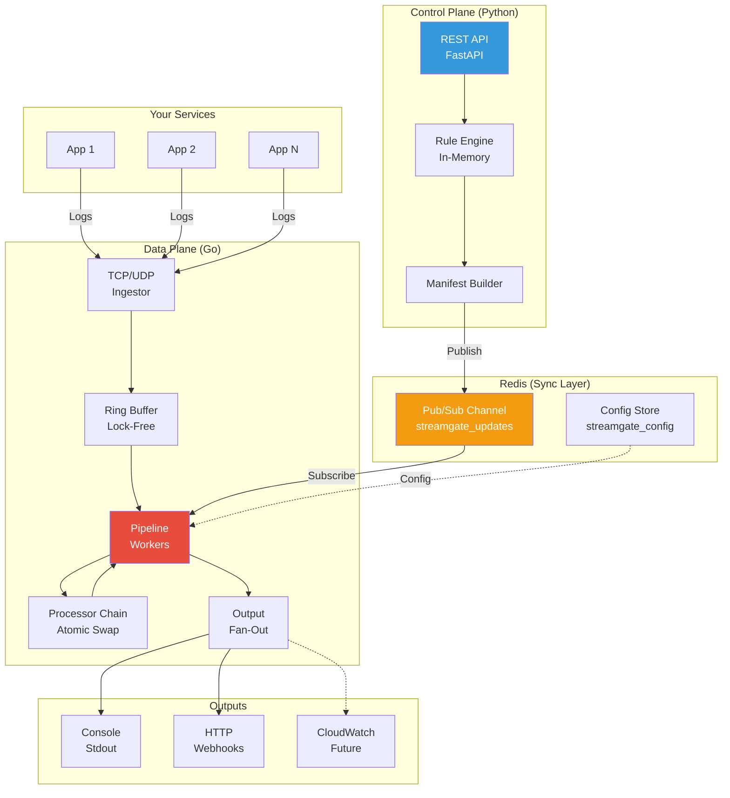

# StreamGate
### 🛡️ The Observability Firewall

**Cut your Datadog/Splunk bill by 40% without losing visibility.**

StreamGate is a high-performance (200k+ events/sec), lock-free proxy that filters noise and redacts PII before logs leave your network. Built with a **Go Data Plane** for speed and a **Python Control Plane** for flexibility.

---

## Why StreamGate?

Most observability agents are **"dumb pipes"**—they send everything. StreamGate acts as a **Smart Valve**.

| Problem | Traditional Agents | StreamGate |
|---------|-------------------|------------|
| **Cost** | Send all logs → Pay per GB | Filter at source → 40-60% reduction |
| **PII Leaks** | Redact in vendor UI (too late) | Redact before egress (network-level) |
| **Configuration** | Restart agents to change rules | Hot-reload via API (zero downtime) |
| **Performance** | Python/Ruby agents (slow) | Go + Lock-Free Buffer (200k+ eps) |

**Use Case**: You have 500 microservices sending DEBUG logs to Datadog. StreamGate sits in front, drops DEBUG, redacts SSNs, and forwards only what matters—saving you $50k/year.

---

## Architecture

StreamGate uses a **Split-Plane Architecture** to separate concerns:



**Key Design Choices**:
- **Go Data Plane**: Zero-allocation ring buffer, atomic hot-swapping.
- **Python Control Plane**: Ergonomic API, schema validation (Pydantic).
- **Redis Sync**: Pub/Sub ensures all Data Plane instances get config updates instantly.

For a deep dive, see [`ARCHITECTURE.md`](./ARCHITECTURE.md).

---

## Features

- **Ingestion**: TCP & UDP listeners (supports syslog, custom protocols)
- **Processing**:
    - Dynamic Filter rules (drop logs by keyword/regex)
    - PII Redaction (SSN, credit cards, custom patterns)
    - Configurable batch size (trade latency for throughput)
- **Output**:
    - Console (stdout)
    - HTTP (POST to any webhook/API)
    - Fan-out (send to multiple destinations simultaneously)
- **Operations**:
    - Hot-reload configuration (zero downtime)
    - Fail-open circuit breaker (never drops logs under load)
    - Docker Compose ready

---

## Quick Start

### Using Docker Compose (Recommended)

```bash
# 1. Clone
git clone https://github.com/sashu2310/streamgate.git
cd streamgate

# 2. Start all services (Redis, Control Plane, Data Plane)
docker-compose up --build

# 3. Verify
curl http://localhost:8000/docs  # API docs
echo "test log" | nc localhost 8081  # Send log
```

### Manual Setup (Development)

**Prerequisites**: Go 1.23+, Python 3.8+, Redis

```bash
# Terminal 1: Redis
docker run -p 6379:6379 -d redis

# Terminal 2: Control Plane
cd control_plane
pip install -r requirements.txt
uvicorn main:app --reload --port 8000

# Terminal 3: Data Plane
go run cmd/streamgate/main.go
```

---

## Usage Example

### 1. Send Logs (Default: Pass-Through)
```bash
echo "DEBUG: user login attempt" | nc localhost 8081
# Output: "DEBUG: user login attempt"
```

### 2. Add Filter Rule (Drop DEBUG logs)
```bash
curl -X POST "http://localhost:8000/rules" \
     -H "Content-Type: application/json" \
     -d '{"id": "drop_debug", "type": "filter", "params": {"value": "DEBUG"}}'

curl -X POST "http://localhost:8000/publish" -d ''
```

### 3. Verify Hot-Reload
```bash
echo "DEBUG: user login attempt" | nc localhost 8081
# Output: (nothing - filtered)

echo "INFO: payment processed" | nc localhost 8081
# Output: "INFO: payment processed"
```

### 4. Redact PII
```bash
curl -X POST "http://localhost:8000/rules" \
     -H "Content-Type: application/json" \
     -d '{"id": "redact_ssn", "type": "redact", "params": {"pattern": "\\d{3}-\\d{2}-\\d{4}", "replacement": "XXX-XX-XXXX"}}'

curl -X POST "http://localhost:8000/publish" -d ''

echo "SSN: 123-45-6789" | nc localhost 8081
# Output: "SSN: XXX-XX-XXXX"
```

### 5. Forward to External API
```bash
# Start mock server
python3 scripts/mock_server.py  # Listens on :9000

# Configure HTTP output
curl -X POST "http://localhost:8000/outputs" \
     -H "Content-Type: application/json" \
     -d '{"type": "http", "url": "http://host.docker.internal:9000"}'

curl -X POST "http://localhost:8000/publish" -d ''

echo "Hello Datadog" | nc localhost 8081
# Check mock_server terminal for POST request
```

---

## Configuration

| Component | Default | Override |
|-----------|---------|----------|
| TCP Port | 8081 | Set `TCP_PORT` env var |
| UDP Port | 8082 | Set `UDP_PORT` env var |
| Redis | localhost:6379 | Set `REDIS_HOST` env var |
| Batch Size | 100 | POST `/config/batch_size` |

---

## Performance

Benchmarked on MacBook Pro M2 (8-core):

| Scenario | Throughput | Latency (p99) |
|----------|-----------|---------------|
| Raw ingestion (no processing) | 200k msgs/sec | <2ms |
| With Filter + Redact | 150k msgs/sec | <5ms |
| HTTP Output (local mock) | 50k msgs/sec | <20ms |

**Bottlenecks**:
- Network I/O for HTTP outputs
- Regex complexity in Redaction
- Buffer size (if ingestion >> processing rate)

See [`ARCHITECTURE.md`](./ARCHITECTURE.md) for design trade-offs.

---

## Capabilities

**Core Engine**:
- High-performance ingestion (TCP/UDP)
- Lock-free ring buffer (10k slots)
- Dynamic processor chain (Filter, Redact)
- Configurable batching (1-10,000)

**Control Plane**:
- REST API (FastAPI + auto-docs)
- JSON schema validation (Pydantic)
- Hot-reload via Redis Pub/Sub

**Output Providers**:
- Console (stdout)
- HTTP (webhooks, Datadog, Splunk)
- Fan-out (multi-destination)

**Operations**:
- Docker Compose orchestration
- Fail-open circuit breaker
- Graceful shutdown

---

## Roadmap

- [ ] CloudWatch native output
- [ ] Sampling processor (probabilistic drop)
- [ ] Multi-worker pipeline (key-based sharding)
- [ ] Prometheus metrics endpoint
- [ ] Kubernetes Helm chart
- [ ] gRPC Control Plane API

---

## Contributing

Pull requests welcome! See [`ARCHITECTURE.md`](./ARCHITECTURE.md) for internal design details.

---

## License

MIT License - See [LICENSE](./LICENSE) for details.
