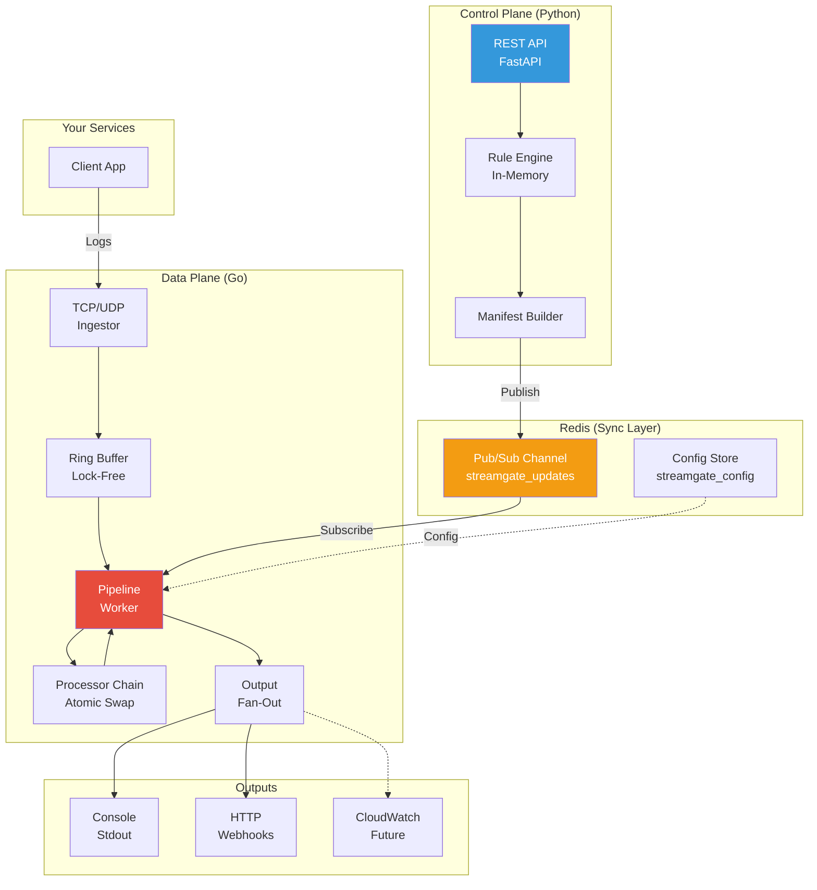

# StreamGate
### 🛡️ The Observability Firewall

**Cut your Datadog/Splunk bill by 40-60% without losing visibility.**

StreamGate is a high-performance, edge-first observability data proxy that puts you in control of your logging costs and data security. By filtering noise and redacting PII before it leaves your network, StreamGate ensures your vendor budgets go further and your data stays compliant.

[Quickstart](#quick-start) | [Docs](ARCHITECTURE.md) | [Performance](#performance)

---

## What is StreamGate?

StreamGate is a specialized **Observability Firewall** designed to sit between your microservices and your upstream vendors (like Datadog, Splunk, or New Relic). It empowers engineering teams to treat their observability data as a manageable resource rather than an uncontrollable expense.

### Principles

*   **Reliable** - Built with a high-performance Go data plane, StreamGate is designed for 24/7 reliability and low overhead.
*   **Dynamic** - Hot-reload configurations in milliseconds via a Python-based control plane. No agent restarts, no dropped logs.
*   **Fail-Open** - Engineered to never block your application. If the proxy is under pressure, it prioritizes your service health over data processing.

### Use Cases

*   **Slash Observability Costs**: Drop high-volume `DEBUG` logs or sample noisy streams at the edge, before they hit your bill.
*   **Enforce PII Compliance**: Redact sensitive data (SSNs, API keys) at the network level, ensuring it never reaches third-party vendors.
*   **Vendor Agility**: Transition between backends or send data to multiple destinations simultaneously without changing your application code.
*   **Developer Agility**: Tweak logging rules in real-time via API to debug live issues without a redeploy.

---

## Why StreamGate?

Most observability agents are **"dumb pipes"**—they send everything. StreamGate acts as a **Smart Valve**.

| Problem | Traditional Agents | StreamGate |
|---------|-------------------|------------|
| **Cost** | Send all logs → Pay per GB | Filter at source → 40-60% reduction |
| **PII Leaks** | Redact in vendor UI (too late) | Redact before egress (network-level) |
| **Configuration** | Restart agents to change rules | Hot-reload via API (zero downtime) |
| **Performance** | Python/Ruby agents (slow) | Go + Lock-Free Buffer (200k+ eps) |

**Use Case**: You have 500 microservices sending DEBUG logs to Datadog. StreamGate sits in front, drops DEBUG, redacts SSNs, and forwards only what matters—saving you $50k/year.

---

## Architecture

StreamGate uses a **Split-Plane Architecture** to separate concerns:



### Split-Plane Design
StreamGate separates the **hot path** from the **logic path**:
- **Go Data Plane**: A stateless, ultra-fast engine optimized for zero-allocation processing and high concurrency.
- **Python Control Plane**: A developer-friendly API for managing rules and seeing live status.
- **Redis Sync Layer**: The glue that enables real-time hot-reloads across all proxy instances without a single restart.

For a technical deep dive, see [`ARCHITECTURE.md`](./ARCHITECTURE.md).

## Quick Start

### Using Docker Compose (Recommended)

```bash
# 1. Clone
git clone https://github.com/sashu2310/streamgate.git
cd streamgate

# 2. Start all services (Redis, Control Plane, Data Plane)
docker-compose up --build

# 3. Verify
curl http://localhost:8000/docs  # API docs
echo "test log" | nc localhost 8081  # Send log
```

### Manual Setup (Development)

**Prerequisites**: Go 1.23+, Python 3.8+, Redis

```bash
# Terminal 1: Redis
docker run -p 6379:6379 -d redis

# Terminal 2: Control Plane
cd control_plane
pip install -r requirements.txt
uvicorn main:app --reload --port 8000

# Terminal 3: Data Plane
go run cmd/streamgate/main.go
```

---

## Usage Example

### 1. Send Logs (Default: Pass-Through)
```bash
echo "DEBUG: user login attempt" | nc localhost 8081
# Output: "DEBUG: user login attempt"
```

### 2. Add Filter Rule (Drop DEBUG logs)
```bash
curl -X POST "http://localhost:8000/rules" \
     -H "Content-Type: application/json" \
     -d '{"id": "drop_debug", "type": "filter", "params": {"value": "DEBUG"}}'

curl -X POST "http://localhost:8000/publish" -d ''
```

### 3. Verify Hot-Reload
```bash
echo "DEBUG: user login attempt" | nc localhost 8081
# Output: (nothing - filtered)

echo "INFO: payment processed" | nc localhost 8081
# Output: "INFO: payment processed"
```

### 4. Redact PII
```bash
curl -X POST "http://localhost:8000/rules" \
     -H "Content-Type: application/json" \
     -d '{"id": "redact_ssn", "type": "redact", "params": {"pattern": "\\d{3}-\\d{2}-\\d{4}", "replacement": "XXX-XX-XXXX"}}'

curl -X POST "http://localhost:8000/publish" -d ''

echo "SSN: 123-45-6789" | nc localhost 8081
# Output: "SSN: XXX-XX-XXXX"
```

### 5. Forward to External API
```bash
# Start mock server
python3 scripts/mock_server.py  # Listens on :9000

# Configure HTTP output
curl -X POST "http://localhost:8000/outputs" \
     -H "Content-Type: application/json" \
     -d '{"type": "http", "url": "http://host.docker.internal:9000"}'

curl -X POST "http://localhost:8000/publish" -d ''

echo "Hello Datadog" | nc localhost 8081
# Check mock_server terminal for POST request
```

---

## Configuration

| Component | Default | Override |
|-----------|---------|----------|
| TCP Port | 8081 | Set `TCP_PORT` env var |
| UDP Port | 8082 | Set `UDP_PORT` env var |
| Redis | localhost:6379 | Set `REDIS_HOST` env var |
| Batch Size | 100 | POST `/config/batch_size` |

---

## Performance

Benchmarked on MacBook Pro M2 (8-core):

| Scenario | Throughput | Latency (p99) |
|----------|-----------|---------------|
| Raw ingestion (no processing) | 200k msgs/sec | <2ms |
| With Filter + Redact | 150k msgs/sec | <5ms |
| HTTP Output (local mock) | 50k msgs/sec | <20ms |

**Bottlenecks**:
- Network I/O for HTTP outputs
- Regex complexity in Redaction
- Buffer size (if ingestion >> processing rate)

See [`ARCHITECTURE.md`](./ARCHITECTURE.md) for design trade-offs.

---

## Capabilities

**Data Ingestion & Routing**
- High-performance TCP/UDP listeners (Syslog/JSON)
- Batching (Trade-off latency for throughput dynamically)

**Output Providers**
- Console (stdout)
- HTTP (StreamGate -> Datadog, Splunk)
- Fan-out (multi-destination)

**Governance & Security**
- Dynamic Filtering (Keyword/Regex based drops)
- PII Redaction (SSN, API Keys, custom patterns)
- Fail-Open Circuit Breaker (Prioritizes application health)

**Operations**
- Real-time API-driven Hot Reloads
- Dockerized & Kubernetes Ready
- Detailed Operation Metrics

## Roadmap

- [ ] CloudWatch & S3 Native Sinks
- [ ] Probabilistic Sampling Transform
- [ ] Kubernetes Helm Chart & Operator
- [ ] Multi-worker Sharded Buffering
- [ ] gRPC Management Interface

---

## Contributing

Pull requests welcome! See [`ARCHITECTURE.md`](./ARCHITECTURE.md) for internal design details.

---

## License

MIT License - See [LICENSE](./LICENSE) for details.
